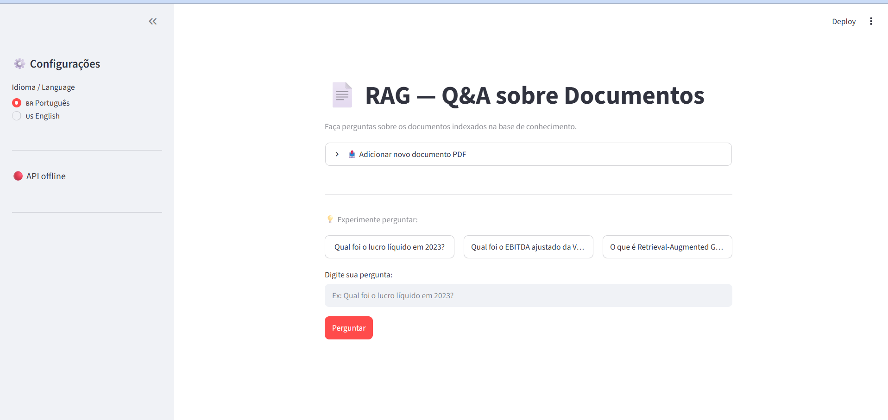
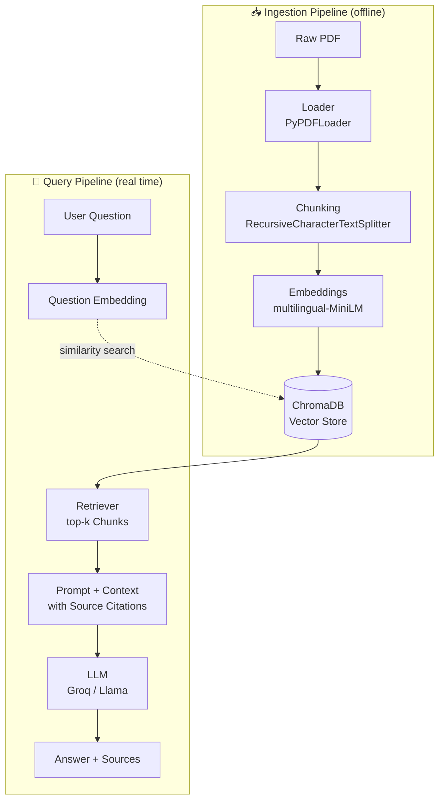

# 📄 RAG PDF Q&A System

A semantic search and question-answering system for PDF documents (financial reports and technical papers), built end-to-end with Retrieval-Augmented Generation (RAG): ingestion, embeddings, vector database, context-augmented generation, REST API, web interface, and formal quality evaluation.

This project was developed as a hands-on MLOps and applied AI engineering exercise. Every technical decision described below was empirically validated rather than copied from a tutorial.

---

## 🖼️ Demo



- **Streamlit Interface:** Ask questions in Portuguese or English, upload new PDFs, view chat history, and see cited sources with page and file references.
- **FastAPI Backend:** REST endpoints automatically documented through Swagger (`/docs`).

---

## 🏗️ Architecture

The system is divided into two independent pipelines:



**Ingestion:** PDF → page-level text extraction → chunking (800 characters with 150-character overlap) → each chunk is converted into a 384-dimensional vector → stored in ChromaDB together with source file and page metadata.

**Retrieval:** user question → embedding generated using the same model → cosine similarity search in ChromaDB → retrieve the top-4 most relevant chunks → assemble a prompt with anti-hallucination instructions → generate an answer via Groq → return the answer with source citations.

---

## ⚙️ Technical Stack

| Layer | Technology | Why |
|---------|------------|------|
| RAG Orchestration | LangChain (LCEL) | Declarative composition of the retriever → prompt → LLM chain |
| Embeddings | `sentence-transformers/paraphrase-multilingual-MiniLM-L12-v2` | Empirically validated on a bilingual PT/EN corpus (see #-technical-decisions-validated-with-data) |
| Vector Database | ChromaDB | Embedded database, local persistence, and native LangChain integration |
| LLM | Groq (Llama 3.3 / GPT-OSS) | Fast inference and a practical free tier for iterative development |
| Backend | FastAPI | Automatic validation via Pydantic and generated Swagger documentation |
| Frontend | Streamlit | Bilingual interface with custom i18n, independent of browser translation |
| Testing | Pytest | Covers deterministic parts of the pipeline |
| Evaluation | RAGAS | Faithfulness, relevance, and context precision/recall metrics |
| Containerization | Docker + Docker Compose | Two isolated services (API + UI) connected through an internal network |

---

## 🚀 Running Locally

### Prerequisites

- Python 3.12+
- A Groq API key from https://console.groq.com

### Setup

```bash
git clone https://github.com/<your-username>/rag-pdf-qa-system.git
cd rag-pdf-qa-system

python -m venv venv
source venv/bin/activate   # Windows: venv\Scripts\Activate.ps1

pip install -r requirements.txt
```

Create a `.env` file at the project root:

```env
GROQ_API_KEY=your_api_key_here
```

Place at least one PDF inside `data/raw/`, then build the vector index:

```bash
python -m src.retrieval.vectorstore
```

Start the API:

```bash
uvicorn src.api.main:app --reload
```

In another terminal, launch the UI:

```bash
PYTHONPATH=. streamlit run src/ui/app.py
```

Access:

- Interface: `http://localhost:8501`
- API Docs: `http://localhost:8000/docs`

### Running with Docker

```bash
docker compose up --build
```

---

## 🧪 Tests

```bash
pytest tests/ -v
```

Coverage includes:

- Text chunking (size, overlap, metadata preservation)
- Prompt context formatting
- Vector store idempotency (see #bug-silent-duplication-in-the-vector-store)

> **Platform Note:** One idempotency test is skipped on Windows due to a known ChromaDB/HNSWLib limitation involving `mmap` file locks within the same process. The behavior is documented inside the test case itself.

---

## 📊 Quality Evaluation (RAGAS)

Formal evaluation using an LLM-as-a-judge approach on three benchmark questions, comparing two different values of `k` (number of retrieved chunks):

| Metric | k=4 | k=2 |
|----------|------|------|
| Faithfulness | 0.67 | 0.79 |
| Answer Relevancy | 0.88 | 0.70 |
| Context Precision | 0.58 | 0.50 |
| Context Recall | **1.00** | 0.33 |

**Decision:** `k=4` was retained in production. Although faithfulness was slightly lower, perfect context recall is more critical for a financial Q&A system. It is preferable to generate a response with minor imperfections than to miss the correct information entirely. Reducing `k` from 4 to 2 caused a severe recall drop, losing required information in two out of three benchmark questions.

---

## 🔍 Technical Decisions Validated with Data

This project avoided making decisions simply because "a tutorial recommended it" whenever possible.

### Multilingual vs. Monolingual Embeddings

Tested quantitatively using cosine similarity between equivalent PT/EN sentence pairs.

The initial monolingual model (`all-MiniLM-L6-v2`) produced a similarity score of **0.08** between "company net income" and its Portuguese equivalent, performing worse than unrelated sentence pairs (**0.45**).

Replacing it with a multilingual model increased the correct similarity score to **0.56**, making cross-language retrieval viable.

### MMR vs. Pure Similarity Search

Tested using `lambda_mult` values of 0.5 and 0.8.

With `lambda_mult=0.5`, MMR introduced low-relevance noise, including the document cover page among retrieved sources.

Standard `similarity_search` was retained because it produced more predictable and relevant results for this corpus.

### k=4 vs. k=2

See the RAGAS evaluation section above.

---

## 🐛 Engineering Challenges (Real Debugging History)

This section documents actual issues encountered and resolved during development. It is not a polished feature list; it reflects what genuinely happened during the project.

### Bug: Silent Duplication in the Vector Store

`Chroma.from_documents()` **appends** to an existing collection by default instead of replacing it.

Running the ingestion script twice silently duplicated every chunk.

The issue was fixed by explicitly clearing the index before rebuilding it and by adding a regression test to prevent future occurrences.

### Bug: Source Ambiguity with Multiple Documents

When indexing two PDFs, both contained a "page 8".

The system originally cited only the page number, making it impossible to determine which document was being referenced.

The fix propagated the source filename throughout the entire pipeline (context formatting → prompt → API response).

### Groq Model Catalog Instability

The model `llama-3.3-70b-versatile`, documented as available, returned a 404 error for the account used in this project.

The issue was diagnosed by querying the `/models` endpoint directly instead of relying on static documentation.

The actual model catalog available to the account differed from the documented listing.

### Platform Limitation: ChromaDB + Windows

Recreating a vector store multiple times within the same Python process on Windows can leave file locks indefinitely due to HNSWLib's use of `mmap`.

This was mitigated in production through retries and explicit error handling and documented as a known skipped test.

### Dependency Conflicts: Local Environment vs. Docker

A local Python environment built gradually over time does not guarantee full dependency compatibility.

Docker builds, which resolve dependencies from scratch, exposed actual conflicts involving `tenacity` and `websockets` that had been silently tolerated by the local environment.

The problem was resolved by pinning compatible version ranges and validating the resulting dependency tree with:

```bash
pip check
```

### Free Deployment and Memory Limits

The multilingual embedding model (~471 MB) makes deployment on Render's 512 MB free tier impractical once PyTorch is loaded.

The documented trade-off is that a production deployment would require either:

- A larger instance with more memory
- Embeddings generated through an external API

---

## 📁 Project Structure

```text
rag-pdf-qa-system/
├── src/
│   ├── ingestion/       # PDF loading and chunking
│   ├── retrieval/       # embeddings, vector store, retriever, prompt, chain, LLM
│   ├── api/             # FastAPI (/query, /upload, /stats)
│   ├── ui/              # Streamlit + PT/EN i18n
│   └── evaluation/      # manual evaluation and RAGAS
├── tests/               # pytest test suite
├── data/raw/            # sample PDFs
├── Dockerfile.api
├── Dockerfile.ui
├── docker-compose.yml
└── requirements.txt
```

---

## 🗺️ Future Improvements

- Structured table extraction (Camelot / Unstructured) to reduce information loss from financial tables flattened into plain text
- Result caching for repeated questions
- Observability metrics (latency, "not found" rate, and cost per query)
- Migration to the non-deprecated RAGAS API (`ragas.metrics.collections`)

---

## 📜 License

MIT License
