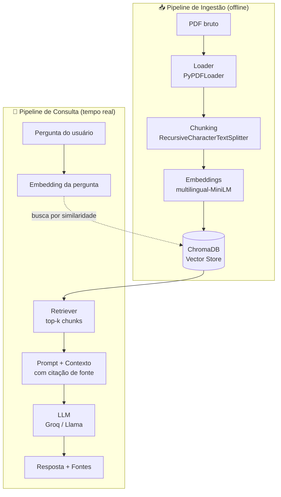

# 📄 RAG PDF Q&A System

Sistema de busca semântica e Q&A sobre documentos PDF (relatórios financeiros e papers técnicos), construído com RAG (Retrieval-Augmented Generation) de ponta a ponta: ingestão, embeddings, vector database, geração aumentada por contexto, API REST, interface web e avaliação formal de qualidade.

Projeto desenvolvido como exercício prático de MLOps e engenharia de IA aplicada — cada decisão técnica abaixo foi validada empiricamente, não copiada de tutorial.

---

## 🖼️ Demo

<!-- Adicione aqui um GIF ou screenshot da interface funcionando -->

- **Interface (Streamlit):** perguntas em PT/EN, upload de novos PDFs, histórico de conversa, fontes citadas por página e arquivo.
- **API (FastAPI):** endpoints REST documentados via Swagger (`/docs`).

---

## 🏗️ Arquitetura

O sistema é dividido em dois pipelines independentes:



**Ingestão:** PDF → texto extraído por página → fragmentação em chunks (800 caracteres, overlap de 150) → cada chunk vira um vetor de 384 dimensões → armazenado no ChromaDB com metadados de arquivo-fonte e página.

**Consulta:** pergunta do usuário → mesmo modelo de embedding → busca por similaridade de cosseno no ChromaDB → top-4 chunks mais relevantes → montagem de prompt com instrução anti-alucinação → geração via LLM (Groq) → resposta com citação de fonte.

---

## ⚙️ Stack técnico

| Camada | Tecnologia | Por quê |
|---|---|---|
| Orquestração RAG | LangChain (LCEL) | Composição declarativa da chain retriever → prompt → LLM |
| Embeddings | `sentence-transformers/paraphrase-multilingual-MiniLM-L12-v2` | Validado empiricamente contra corpus bilíngue PT/EN (ver [Decisões Técnicas](#-decisões-técnicas-validadas-com-dados)) |
| Vector Database | ChromaDB | Embarcado, persistência local, integração nativa com LangChain |
| LLM | Groq (Llama 3.3 / GPT-OSS) | Inferência rápida, tier gratuito viável para desenvolvimento iterativo |
| Backend | FastAPI | Validação automática via Pydantic, documentação Swagger gerada |
| Frontend | Streamlit | Interface bilíngue (i18n próprio, não depende de tradutor de navegador) |
| Testes | Pytest | Cobertura das partes determinísticas do pipeline |
| Avaliação | RAGAS | Métricas de faithfulness, relevância e precisão/recall de contexto |
| Containerização | Docker + Docker Compose | Dois serviços isolados (API + UI) com rede interna |

---

## 🚀 Como rodar localmente

### Pré-requisitos
- Python 3.12+
- Uma chave de API da [Groq](https://console.groq.com)

### Setup

```bash
git clone https://github.com/<seu-usuario>/rag-pdf-qa-system.git
cd rag-pdf-qa-system

python -m venv venv
source venv/bin/activate   # Windows: venv\Scripts\Activate.ps1

pip install -r requirements.txt
```

Crie um `.env` na raiz:
```
GROQ_API_KEY=sua_chave_aqui
```

Coloque ao menos um PDF em `data/raw/`, depois construa o índice:
```bash
python -m src.retrieval.vectorstore
```

Suba a API:
```bash
uvicorn src.api.main:app --reload
```

Em outro terminal, suba a interface:
```bash
PYTHONPATH=. streamlit run src/ui/app.py
```

Acesse `http://localhost:8501` (interface) e `http://localhost:8000/docs` (API).

### Rodando com Docker

```bash
docker compose up --build
```

---

## 🧪 Testes

```bash
pytest tests/ -v
```

Cobre: fragmentação de texto (tamanho, overlap, preservação de metadados), formatação de contexto para o prompt, e idempotência do vector store (ver [Bug: duplicação silenciosa](#bug-duplicação-silenciosa-no-vector-store)).

> **Nota de plataforma:** um teste de idempotência é pulado (`skip`) no Windows devido a uma limitação conhecida do ChromaDB/HNSWLib com locks de arquivo `mmap` dentro do mesmo processo — documentado no próprio teste.

---

## 📊 Avaliação de qualidade (RAGAS)

Avaliação formal com LLM-as-judge sobre 3 perguntas de referência, comparando duas configurações de `k` (número de chunks recuperados):

| Métrica | k=4 | k=2 |
|---|---|---|
| Faithfulness | 0.67 | 0.79 |
| Answer Relevancy | 0.88 | 0.70 |
| Context Precision | 0.58 | 0.50 |
| Context Recall | **1.00** | 0.33 |

**Decisão:** mantido `k=4` em produção. Apesar do faithfulness levemente inferior, o *context recall* perfeito é mais crítico para um sistema de Q&A financeiro — é preferível uma resposta com pequena imprecisão a uma que não encontra a informação correta. Reduzir `k` para 2 causou queda abrupta de recall (perda de informação necessária em 2 das 3 perguntas testadas).

---

## 🔍 Decisões técnicas validadas com dados

Este projeto evitou decisões "porque um tutorial disse" sempre que possível:

- **Embedding multilíngue vs. monolíngue:** testado quantitativamente com similaridade de cosseno entre frases equivalentes em PT/EN. O modelo monolíngue inicial (`all-MiniLM-L6-v2`) apresentou similaridade de **0.08** entre "lucro líquido da empresa" e sua tradução em inglês — pior que frases não relacionadas (0.45). Trocado para modelo multilíngue, que elevou a similaridade correta para **0.56**.
- **MMR vs. similarity search puro:** testado com `lambda_mult` de 0.5 e 0.8. Em 0.5, o MMR introduziu ruído de baixa relevância (a página de capa do documento apareceu como fonte). Mantido `similarity_search` simples por ser mais previsível para este corpus.
- **k=4 vs. k=2:** ver seção de avaliação RAGAS acima.

---

## 🐛 Desafios de engenharia (histórico real de debugging)

Esta seção documenta problemas genuínos encontrados e resolvidos durante o desenvolvimento — não é uma lista polida de features, é o que realmente aconteceu.

### Bug: duplicação silenciosa no vector store
`Chroma.from_documents()` **adiciona** a uma coleção existente por padrão, em vez de substituí-la. Rodar o script de ingestão duas vezes duplicava todos os chunks silenciosamente. Corrigido com limpeza explícita do índice antes de reconstruir, e coberto por teste de regressão automatizado.

### Bug: ambiguidade de fonte com múltiplos documentos
Ao indexar dois PDFs diferentes, ambos tinham uma "página 8" — o sistema citava a fonte só pelo número da página, sem indicar de qual arquivo. Corrigido propagando o nome do arquivo-fonte por toda a cadeia (formatação de contexto → prompt → resposta da API).

### Instabilidade de catálogo de modelos (Groq)
O modelo `llama-3.3-70b-versatile`, documentado como disponível, retornava 404 para a conta usada no projeto. Diagnosticado consultando a API `/models` diretamente (não confiando em documentação estática) — o catálogo real disponível era diferente do esperado.

### Limitação de plataforma: ChromaDB + Windows
Recriar um vector store dentro do mesmo processo Python, no Windows, pode manter um lock de arquivo indefinidamente (HNSWLib usa `mmap`). Mitigado em produção com retry e tratamento de erro; documentado como skip conhecido nos testes automatizados.

### Conflitos de dependência: ambiente local vs. Docker
`pip freeze` local não valida retroativamente a árvore completa de compatibilidade entre pacotes instalados incrementalmente ao longo do projeto. A build Docker (resolução estrita, do zero) revelou conflitos reais (`tenacity`, `websockets`) que o ambiente local vinha tolerando silenciosamente. Resolvido fixando faixas de versão compatíveis, validadas com `pip check`.

### Deploy gratuito e limite de memória
O modelo de embedding multilíngue (471MB) inviabiliza o tier gratuito de 512MB do Render junto com PyTorch carregado. Trade-off documentado: produção real usaria uma instância com mais memória ou embeddings via API.

---

## 📁 Estrutura do projeto

```
rag-pdf-qa-system/
├── src/
│   ├── ingestion/       # loader de PDF, chunking
│   ├── retrieval/       # embeddings, vector store, retriever, prompt, chain, LLM
│   ├── api/             # FastAPI (endpoints /query, /upload, /stats)
│   ├── ui/              # Streamlit + i18n (PT/EN)
│   └── evaluation/      # avaliação manual e RAGAS
├── tests/               # suíte pytest
├── data/raw/            # PDFs de exemplo
├── Dockerfile.api
├── Dockerfile.ui
├── docker-compose.yml
└── requirements.txt
```

---

## 🗺️ Próximos passos

- Extração estruturada de tabelas (Camelot/Unstructured) para reduzir perda de estrutura em tabelas financeiras achatadas em texto
- Cache de resultados para perguntas repetidas
- Métricas de observabilidade (latência, taxa de "não encontrei", custo por query)
- Migração do RAGAS para versão não-depreciada (`ragas.metrics.collections`)

---

## 📜 Licença

MIT
